# Estudo de desenvolvimento de API com Laravel e Frontend com Vue.js
## API de Locadora de Carros
#### ( em desenvolvimento )
   

#### Funções concluídas do lado da API
Através de uma aplicação de manipulação de API como o Postman, o usuário pode:   
- cadastrar marcas, modelos, carros, clientes e locações armazenando os registros no banco de dados  
- buscar um registro por id  
- listar todos os registros  
- listar os registros que se enquadram em um conjunto de atributos parametrizados  
- visualizar dados e um registro específico por id  
- atualizar todos dados através do protocolo PUT  
- atualizar apenas alguns dados através do protocolo PATCH  
- excluir um registro do banco de dados.  
  
##### Observações sobre a API:
 - apenas a rota de login está aberta sem exigir autenticação  
 - se a autenticação for feita com sucesso gera um novo token padrão JWT Bearer  
 - foi configurado o prefixo 'v1' para acessar a api permitindo que haja versões diferentes  
 - deve ser configurado no Postman, ou outro manipulador de API, os Headers: "Accept" -> "application/json" e o "Authorization" com o valor Bearer seguido do token gerado que fica algo como "Bearer eyJ0eXAiOi..."  
 - o 'JWT_TTL' está configurado para 60 minutos, mas pode ser alterado o tempo de validade no arquivo 'jwt.php' dentro do diretório 'config'  
 - o cadastro de marcas exige que seja enviado uma imagem de logomarca, para isso configure no Postman o Body da requisição na opção form-data a Key 'imagem'  
 - como a api permite upload de arquivos, deve ser criado um link simbólico executando o comando: `php artisan storage:link`  
  
#### Funções concluídas do lado da aplicação Frontend
Foram desenvolvidas as páginas para as seguintes funcionalidades:  
- registro de usuário  
- login de usuário  
- homepage do administrador  
- menu dropdown  
- funcionalidades de CRUD de marcas  
- busca de marcas por filtros: id ou nome  
- listagem com paginação para marcas  
  
 As funcionalidades para clientes, locações, carros e modelos serão desenvolvidas futuramente.  
 Toda vez que for feito login pelo formulário será gerado um novo token, caso este expire, basta fazer logout e login novamente 

### Para testar o projeto
1. Clone o repositório dentro de uma pasta específica executando o comando: `git clone https://github.com/paulocaetanomt88/app_locadora_carros.git`  
2. Acesse o diretório do projeto baixado, exemplo: `cd app_locadora_carros`  
3. Crie um banco de dados MySQL e configure o nome do banco criado, o host e a porta do SGBD no arquivo .env do projeto Laravel na raiz do app  
4. Para rodar a aplicação backend e acessar as funções de API, execute o comando: `php artisan serve`  
5. Para rodar a aplicação frontend e acessar as interfaces pelo navegador, execute o comando: `npm run watch`  

#### seguindo as seções 17, 18 e 19 do curso de Desenvolvimento Web Avançado com PHP, Laravel e Vue.JS na plataforma Udemy  
### Seção "17 - APIS, Web services e REST"
<ul>
    <li>Criação das Models, Controllers e Migrations</li>
    <li>Configurar conexão com o banco de dados</li>
    <li>Entendendo o grupo de rotas Web e API e a importância do Content-Type</li>
    <li>Rotas e a diferença entre Route::resource e Route::apiResource</li>
    <li>Extra (fix da aula anterior) - Atributo $namespace de RouteServiceProvide</li>
    <li>Criando registros via POST</li>
    <li>Selecionando registros via GET</li>
    <li>Atualizando registros via PUT e PATCH</li>
    <li>Removendo registros via DELETE</li>
    <li>Extra - Entendendo o conceito de endpoint (URL, URN e URI)</li>
    <li>Injetando a instância do Model no Controller e como lidar com o Type Hinting</li>
    <li>Validações parte 1 - Controle de fluxos</li>
    <li>Validações parte 2 - Status Code HTTP</li>
    <li>Validações parte 3 - Validando parâmetros e a importância do Accept</li>
    <li>Implementando as regras de validação (Rules) no Model</li>
    <li>Validações parte 4 - Regras de validação no Update - Lidando com o Unique</li>
    <li>Validações parte 5 - Regras de validação no Update - Lidando com o PUT/PATCH</li>
    <li>Upload de arquivos - Implementando o upload de imagens</li>
    <li>Upload de arquivos - Criando um link simbólico para o disco public</li>
    <li>Correção do link simbólico do projeto</li>
    <li>Upload de arquivos - Atualizando imagens</li>
    <li>Upload de arquivos - Removendo imagens</li>
    <li>API WebService Rest para o Resource Modelo</li>
    <li>Testando os endpoints de modelo</li>
    <li>Adicionando o relacionamento entre modelos e marcas</li>
    <li>Refactoring do endpoint update de marca e modelo</li>
    <li>Filtros - Selecionando os atributos de retorno</li>
    <li>Filtros - Obtendo colunas específicas com a instrução with()</li>
    <li>Filtros - Aplicando condições nas pesquisas parte 1</li>
    <li>Filtros - Aplicando os filtros ao resource Marca</li>
    <li>Repository Design Pattern - Introdução</li>
    <li>Repository Design Pattern - Implementando um Repository para Marca</li>
    <li>Repository Design Pattern - Implementando um Repository para Modelo</li>
    <li>Repository Design Pattern - Implementando um Abstract Repository</li>
    <li>API WebService Rest para o Resource Carro</li>
    <li>API WebService Rest para o Resource Cliente</li>
    <li>API WebService Rest para o Resource Locacoes</li>
</ul>

### Seção "18 - Autenticação API com Autorização JWT (JSON Web Token)"
<ul>
    <li>Introdução ao JWT (Json Web Token)</li>
    <li>Instalando o pacote JWT-Auth</li>
    <li>Configurando o JWT-Auth no projeto</li>
    <li>Implementando a interface JWTSubject no model User e o Auth Guard API Driver JWT</li>
    <li>Criando as rotas de autenticação e autorização e o AuthController</li>
    <li>Implementando o método de login (autenticação) e o JWT (autorização)</li>
    <li>Configurando rotas protegidas por autorização</li>
    <li>Criando um grupo de rotas protegidas com um prefix de versionamento</li>
    <li>Enviando o JWT de autorização nas requisições (Authorization Bearer)</li>
    <li>Recuperando os dados do usuário autenticado com base no JWT</li>
    <li>Atualizando o JWT (renovando a autorização)</li>
    <li>Invalidando o JWT (revogando a autorização)</li>
    <li>Anatomia do JWT (Json Web Token)</li>
    <li>Expirando o JWT por tempo limite</li>
</ul>

#### Alguns prints de Funcionalidades da API:

  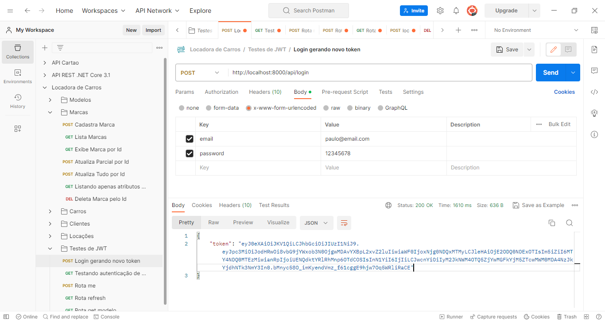

  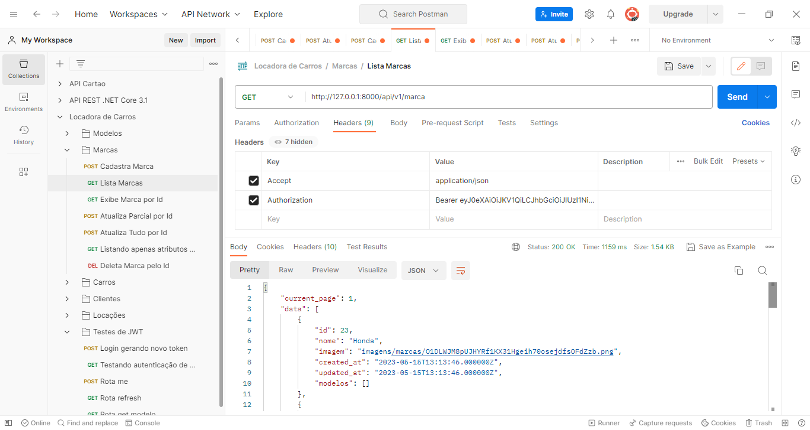

  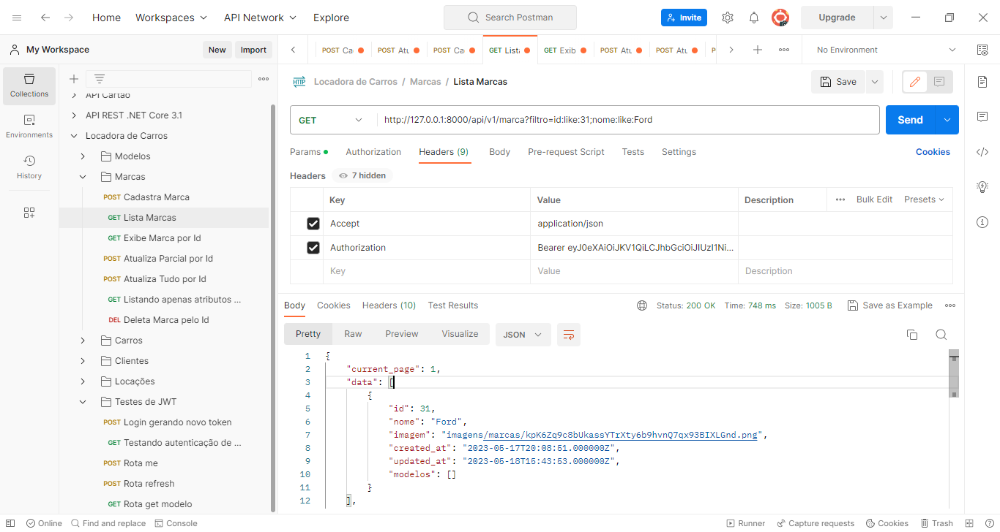

  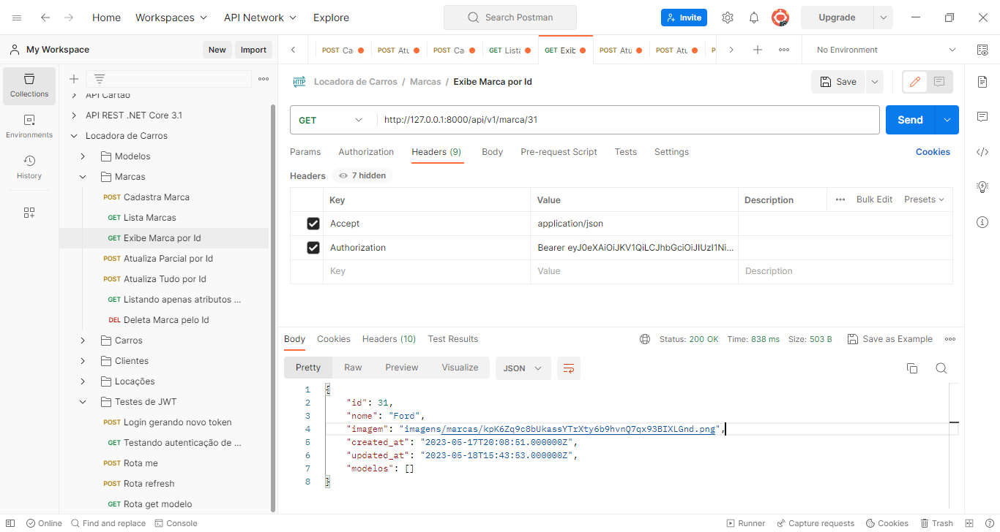

  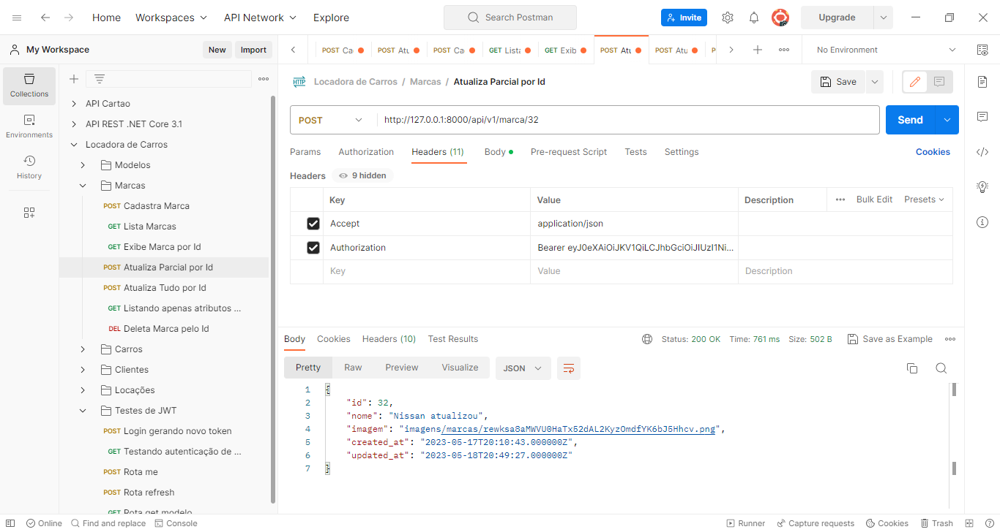

  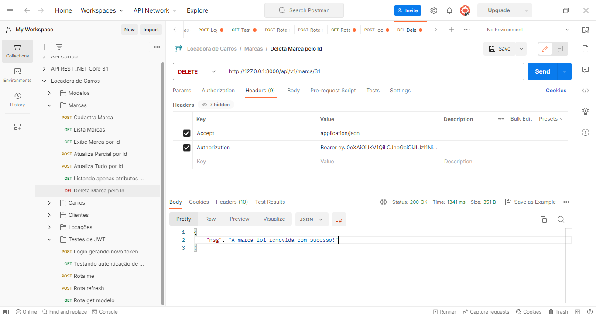

### Seção "19 - Aplicação Full Stack Back-end API Laravel com Front-end Vue.JS"
<ul>
    <li>Configurando o Vue.JS no Laravel</li>
    <li>Evitando erros com o projeto da seção</li>
    <li>Convertendo a view login em um componente Vue</li>
    <li>Gerando o build da aplicação front com o npm run watch</li>
    <li>Vue Props - Encaminhando o token csrf para o componente Login</li>
    <li>Implementando a autenticação web (sessão) e API (JWT)</li>
    <li>Convertendo a view home em um componente Vue</li>
    <li>Criando o menu de navegação da aplicação</li>
    <li>Criando a rota, a view e o componente</li>
    <li>Criando o card de busca de registros</li>
    <li>Criando um componente Vue para encapsular inputs</li>
    <li>Criando o card de listagem de registros</li>
    <li>Criando um componente Vue para tables</li>
    <li>Criando um componente Vue para cards</li>
    <li>Extra - Adicionando um breadcrumb</li>
    <li>Criando um modal para inclusão de registros de marcas</li>
    <li>Adicionando os inputs no modal de registros de marcas</li>
    <li>Cadastrando marcas</li>
    <li>Entendendo como o token de autorização é anexado as requisições</li>
    <li>Adicionando o token de autorização ao cabeçalho das requisições</li>
    <li>Corrigindo o erro de inclusão do popper.js.map</li>
    <li>Configurando os alertas de sucesso e erro do cadastro de marcas</li>
    <li>Evitando dependências nos componentes Vue</li>
    <li>Recuperando os registros de marcas</li>
    <li>Adicionando os cabeçalhos na requisição de marcas</li>
    <li>Listando os registros de marcas</li>
    <li>Evitando dependências no componente Table</li>
    <li>Adicionando metadados aos títulos da listagem</li>
    <li>Adicionando a paginação de registros</li>
    <li>Corrigindo o atributo marcas</li>
    <li>Adicionando a paginação de registros</li>
    <li>Buscando registros</li>
    <li>Adicionando os botões para visualização, atualização e remoção de registros</li>
    <li>Implementando o modal de visualização da marca</li>
    <li>Instalando e configurando o Vuex no projeto</li>
    <li>Implementando o modal de remoção de registros</li>
    <li>Implementando o modal de atualização de registros</li>
    <li>Refactoring do update de marca do lado do back-end</li>
    <li>Adicionando filtros para formatação de datas</li>
    <li>Axios - Interceptando requisições e respostas HTTP</li>
    <li>Axios - Interceptando o request e configurando os headers</li>
    <li>Axios - Interceptando o response e realizando um auto refresh do JWT</li>
    <li>Considerações finais sobre a seção e o projeto prático</li>
</ul>
 

 #### Alguns prints de Funcionalidades da Aplicação Front-end com Vue.js:

  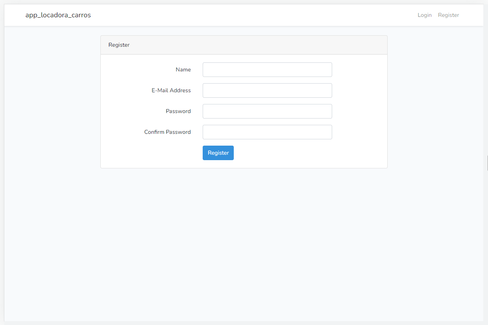

  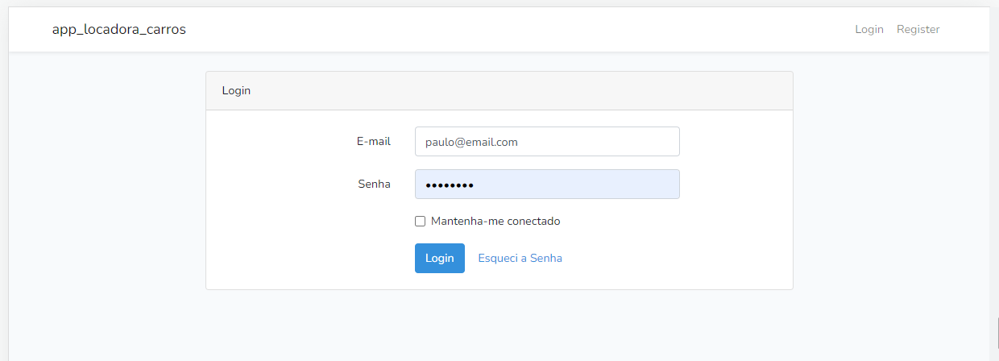

  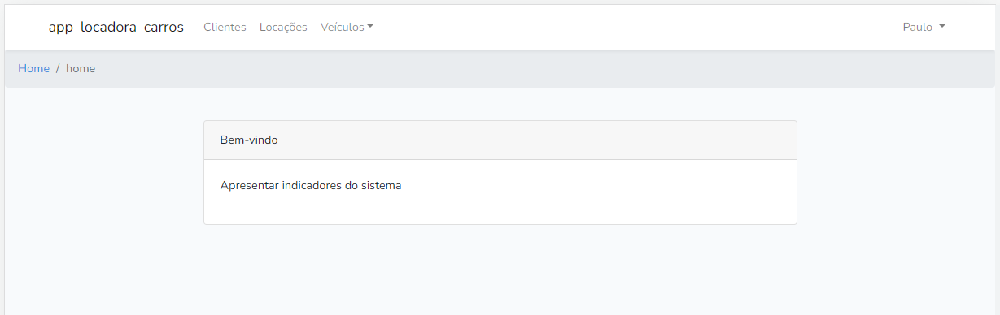

  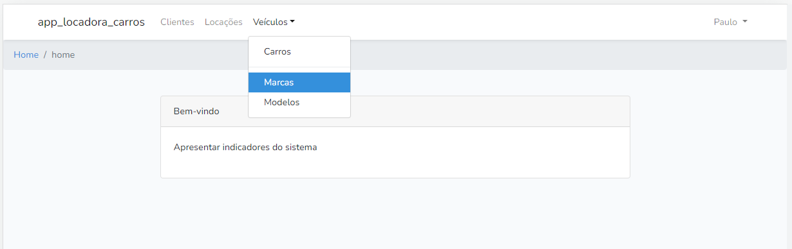

  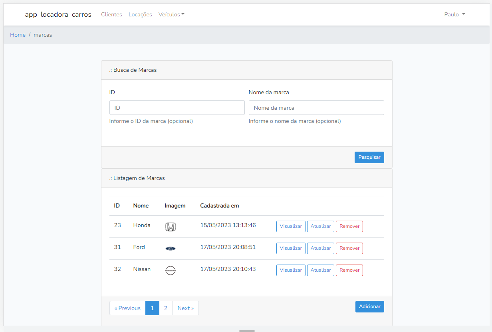

  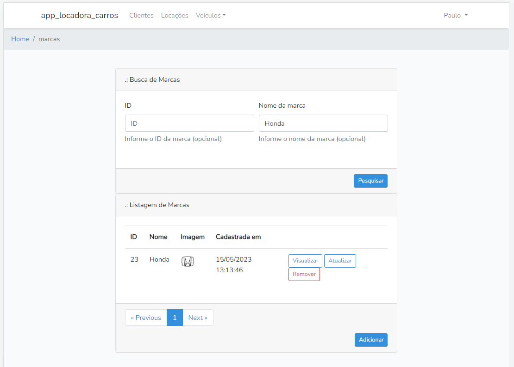

  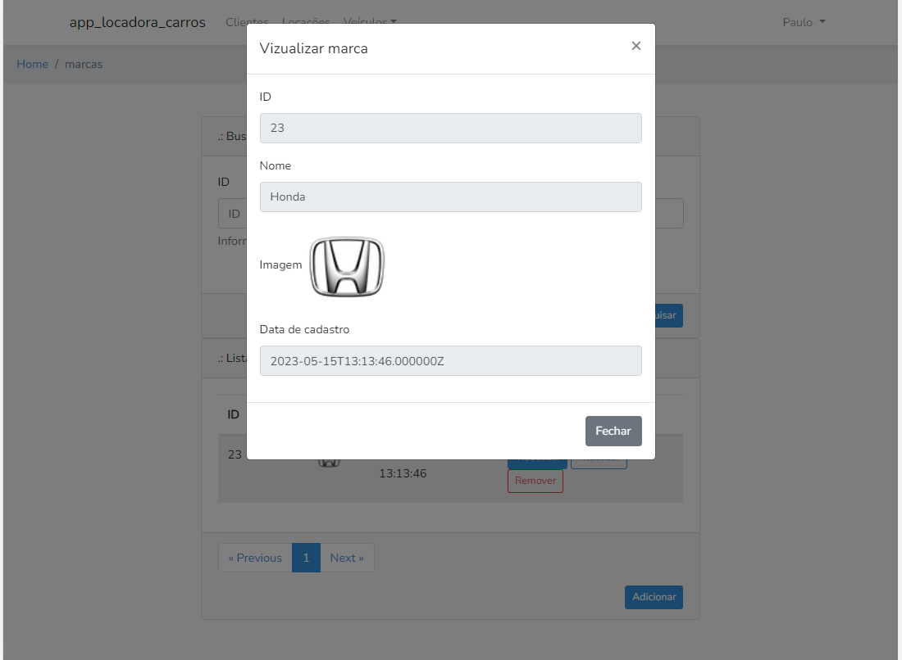

  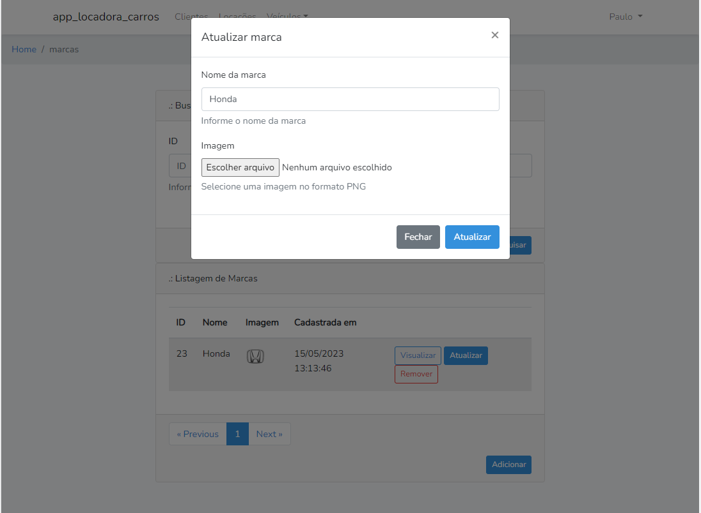

  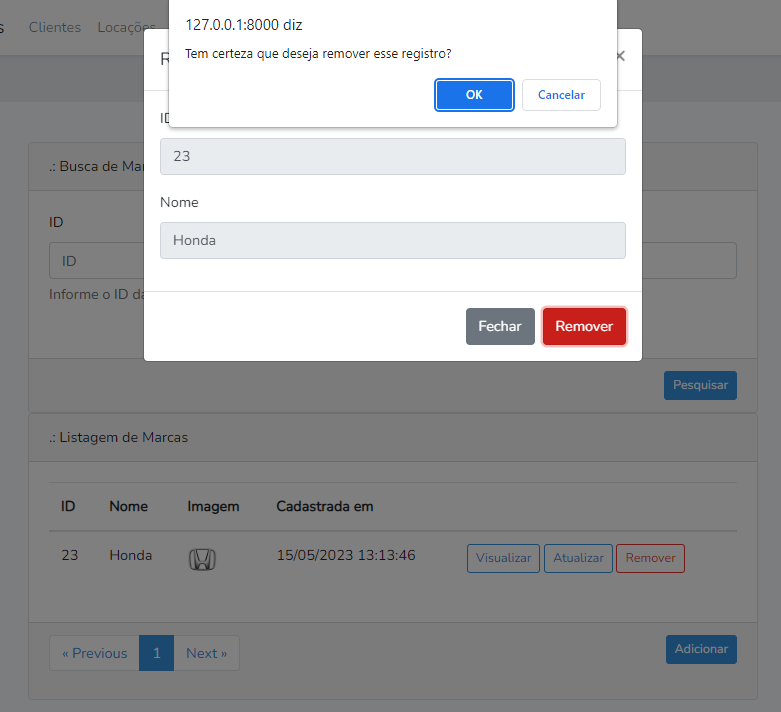

  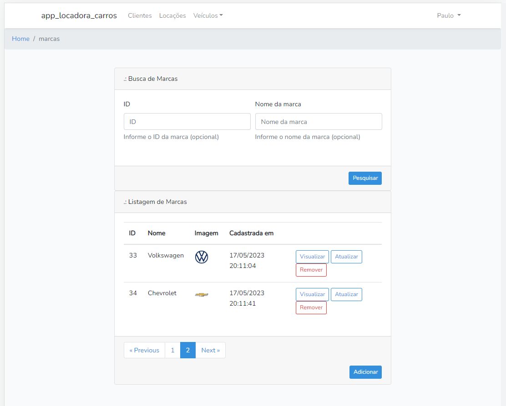

  Há também a funcionalidade de Logout no menu que se abre clicando no nome do usuário Logado, em seguida em 'Logout'

## About Laravel

Laravel is a web application framework with expressive, elegant syntax. We believe development must be an enjoyable and creative experience to be truly fulfilling. Laravel takes the pain out of development by easing common tasks used in many web projects, such as:

- [Simple, fast routing engine](https://laravel.com/docs/routing).
- [Powerful dependency injection container](https://laravel.com/docs/container).
- Multiple back-ends for [session](https://laravel.com/docs/session) and [cache](https://laravel.com/docs/cache) storage.
- Expressive, intuitive [database ORM](https://laravel.com/docs/eloquent).
- Database agnostic [schema migrations](https://laravel.com/docs/migrations).
- [Robust background job processing](https://laravel.com/docs/queues).
- [Real-time event broadcasting](https://laravel.com/docs/broadcasting).

Laravel is accessible, powerful, and provides tools required for large, robust applications.

## License

The Laravel framework is open-sourced software licensed under the [MIT license](https://opensource.org/licenses/MIT).
